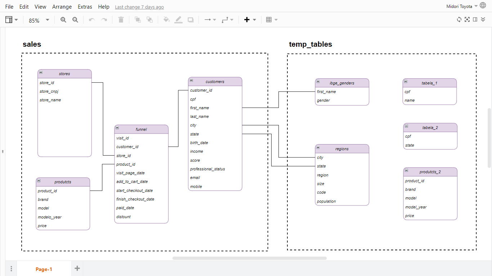

# 📊 Análise de Dados com PostgreSQL

Repositório dedicado ao estudo e aplicação de SQL para Análise de Dados utilizando PostgreSQL.

Este projeto reúne fundamentos da linguagem SQL, mais de 70 exercícios práticos e dois projetos aplicados simulando cenários reais de negócio.
## 🗂 Modelagem do Banco

  

---

## 🚀 Tecnologias Utilizadas

- PostgreSQL
- SQL
- PgAdmin
- Modelagem Relacional
- Git & GitHub

---

# 📚 Conteúdo do Repositório

## 🟢 Fundamentos de SQL

- Sintaxe básica do SQL
- SELECT
- WHERE
- ORDER BY
- LIMIT
- Operadores lógicos
- LIKE e ILIKE
- BETWEEN
- IN
- IS NULL

---

## 🔵 Funções de Agregação

- COUNT()
- SUM()
- AVG()
- MAX()
- MIN()
- GROUP BY
- HAVING

Aplicação prática para análise de métricas e indicadores de negócio.

---

## 🟣 Relacionamento entre Tabelas

- INNER JOIN
- LEFT JOIN
- RIGHT JOIN
- FULL JOIN

Construção de análises envolvendo múltiplas tabelas e modelagem relacional.

---

## 🟡 Queries Avançadas

- Subqueries simples
- Subqueries correlacionadas
- Subqueries no SELECT
- Subqueries no WHERE
- CTE (Common Table Expressions)

---

## 🧹 Limpeza e Tratamento de Dados

- UPDATE
- DELETE
- Padronização de dados
- Tratamento de valores NULL
- Criação e manipulação de tabelas
- Tipos de dados e constraints

---

# 🏋️ Exercícios Práticos

Mais de **70 exercícios resolvidos**, organizados por nível:

- Básico
- Intermediário
- Avançado
- Casos aplicados a negócio

Cada exercício contém comentários explicando o objetivo da consulta e a lógica utilizada.

---

# 📂 Projetos Desenvolvidos

## 📌 Projeto 1 – Análise de Vendas

Análise exploratória de dados de vendas contendo:

- Faturamento total
- Ticket médio
- Produtos mais vendidos
- Clientes mais lucrativos
- Análise por região
- Ranking de desempenho

Objetivo: Simular análises realizadas por um Analista de Dados em uma empresa de varejo.

---

## 📌 Projeto 2 – Análise de Clientes

Estudo comportamental da base de clientes:

- Frequência de compra
- Receita por cliente
- Segmentação
- Identificação de clientes recorrentes
- Análise de retenção

Objetivo: Aplicar SQL para gerar insights estratégicos para o negócio.

---

# 🎯 Objetivo do Projeto

Demonstrar domínio prático de SQL aplicado à análise de dados, explorando:

- Manipulação de grandes volumes de dados
- Criação de métricas de negócio
- Extração de insights
- Modelagem relacional
- Pensamento analítico

---

# 📈 Competências Demonstradas

- Análise Exploratória de Dados (EDA)
- SQL para Negócios
- Raciocínio Analítico
- Organização de Projetos
- Estruturação de Banco Relacional
- Documentação Técnica

---

# 🧠 Aplicação em Cenários Reais

Todas as consultas foram pensadas simulando demandas reais de empresas como:

- Análise de faturamento
- Identificação de gargalos
- Segmentação de clientes
- Performance de produtos
- Apoio à tomada de decisão

---

# 🛠 Como Executar

1. Instale o PostgreSQL
2. Execute os scripts de criação das tabelas
3. Execute o script de população do banco
4. Rode as queries presentes nas pastas de exercícios ou projetos

---

# 📌 Autor

Samuel Martins de Albuquerque  
Graduado em Análise e Desenvolvimento de Sistemas  
Focado em Análise de Dados e Business Intelligence 
Este portfólio foi desenvolvido com base no curso "SQL para Análise de Dados: Do básico ao avançado", ministrado pela professora Midori Toyota na Udemy.
https://www.udemy.com/course/sql-para-analise-de-dados/learn/lecture/30132122#overview

---

⭐ Se este projeto te ajudou ou você gostou da estrutura, deixe uma estrela no repositório.